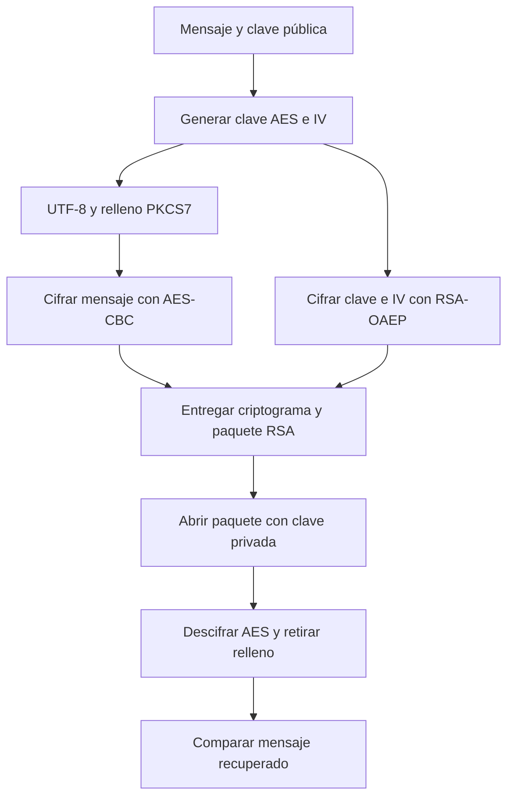

# Práctica 03 - Algoritmo híbrido RSA + AES

**Ulises Zarate Concha · Seguridad Informática · UACAM**

[Abrir reporte PDF con capturas](../Practica3_Hibrido_Reporte.pdf)

## Objetivo

Cifrar un mensaje con AES y proteger su clave de sesión con RSA. El receptor
recupera el mensaje con su clave privada. La demostración se inicia al ejecutar
el archivo principal; las nueve pruebas están integradas en ese mismo archivo.

## Archivos

- `algoritmo_hibrido.py`: funciones, demostración y pruebas.
- `requirements.txt`: dependencia cryptography.
- `README.md`: explicación y guía de ejecución.

## Ejecución

Desde esta carpeta:

```powershell
python -m pip install -r requirements.txt
python -X utf8 algoritmo_hibrido.py
python -X utf8 algoritmo_hibrido.py --mensaje "Mensaje de Ulises"
python -X utf8 algoritmo_hibrido.py --pruebas
```

El comando sin argumentos imprime el mensaje original, el tamaño del paquete RSA,
el criptograma AES en Base64, el mensaje recuperado y la comprobación final.
Las claves se generan en memoria y no se guardan en archivos.

## Funcionamiento

1. `generar_par_rsa` crea claves RSA de 2048 bits y exponente público 65537.
2. `get_Msj_And_Key` genera una clave AES de 32 bytes y un IV de 16 bytes con `os.urandom`.
3. `Cifrado_AES_enviar_mensaje` codifica el texto en UTF-8, aplica relleno PKCS7 y cifra con AES-CBC.
4. La clave y el IV se concatenan en un paquete de 48 bytes y se cifran con RSA-OAEP-SHA256.
5. `decifrar_mensaje` abre el paquete RSA, separa clave e IV, descifra AES y retira el relleno.
6. La demostración convierte los bytes recuperados a UTF-8 y los compara con el original.

## Justificación de diseño

- AES-256 usa la clave de 32 bytes solicitada. CBC se conserva porque lo pide el ejercicio.
- El IV es de **16 bytes**: el bloque de AES mide 128 bits. El valor de 32 bytes indicado en el enunciado no es válido como IV de AES-CBC.
- PKCS7 permite cifrar textos de cualquier longitud, incluido el texto vacío.
- RSA usa OAEP con SHA-256 y MGF1-SHA256. La clave AES y el IV caben en un único paquete.
- `iv_cifrado_RSA` contiene tanto la clave como el IV protegidos; su nombre se conserva por compatibilidad con el enunciado.
- Base64 solo representa el criptograma en consola; no añade seguridad.

## Diagrama de flujo



## Resultados de pruebas

Ejecución local con Python 3.12.10 y cryptography 49.0.0. Las **9 rutinas se completaron sin errores**.

1. Mensaje normal: original y recuperado coinciden.
2. Mensaje vacío: recuperación correcta.
3. Mensaje de 501 caracteres: recuperación completa.
4. Acentos, emoji y caracteres chinos: recuperación correcta.
5. Mismo mensaje cifrado dos veces: criptogramas distintos.
6. Clave privada incorrecta: rechazada con `ValueError`.
7. Modificación del criptograma: el contenido cambia sin ser rechazado; demuestra la falta de autenticación de CBC.
8. Función auxiliar: produce un criptograma de 32 bytes para el texto de prueba.
9. Diez ciclos con mensajes de 10 000 bytes: cada recuperación coincide con el original. El tiempo varía según el equipo.

La captura de la ejecución está incluida en el PDF. Las pruebas son demostraciones
reproducibles; no prueban por sí solas la seguridad completa del sistema.

## Análisis de seguridad

El sistema protege la confidencialidad bajo el supuesto de que la clave privada
permanece secreta y la clave pública pertenece al receptor esperado. Una nueva
clave AES y un nuevo IV se generan por mensaje.

**CBC no autentica el mensaje.** Un atacante puede modificar el criptograma y el
receptor podría devolver datos alterados. Un relleno válido no demuestra integridad.
OAEP no protege por sí solo la autenticidad del criptograma AES ni identifica al emisor.

Para un sistema con adversarios activos se necesita autenticación, por ejemplo
AES-GCM o cifrar y luego autenticar con HMAC y una clave independiente. También
faltan verificación de identidad de claves, control de repetición y secreto hacia adelante.
No se implementa borrado garantizado de claves en memoria.

## Referencias

- [Cryptography: cifrado simétrico y CBC](https://cryptography.io/en/latest/hazmat/primitives/symmetric-encryption/).
- [Repositorio de referencia para la organización de la práctica](https://github.com/Rafa093Spartan/62151_Inurreta).

La estructura de entrega sigue la referencia solicitada. Esta implementación conserva
el empaquetado conjunto de clave e IV y sus propias pruebas y documentación.
