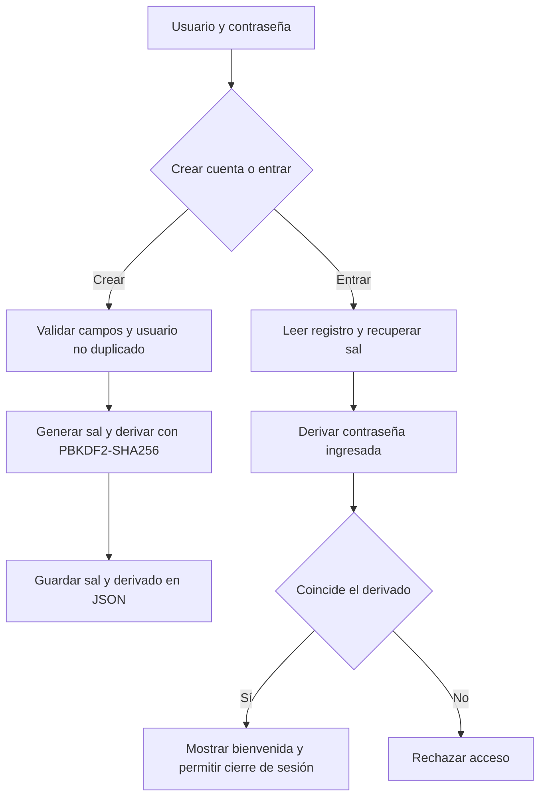

# Práctica 04 - Registro, acceso y algoritmo Hash

**Ulises Zarate Concha · Seguridad Informática · UACAM**

[Abrir reporte PDF con capturas](Practica4_Hash_Reporte.pdf)

## Objetivo y alcance

Construir una aplicación gráfica que registre usuarios, conserve sus credenciales
derivadas en JSON, verifique el acceso y permita cerrar la sesión. Una segunda
pestaña permite experimentar con SHA-256 y el efecto avalancha.

El alcance toma como referencia funcional el repositorio indicado por el alumno;
no se cuenta con un enunciado oficial independiente para la práctica 4. La interfaz,
la lógica de cuentas, las pruebas y la documentación se desarrollaron para esta entrega.

## Archivos de la práctica

```text
Practica_04_Algoritmo-Hash/
    main.py
    utils/
        login_app.py
        saveJson.py
        secureAES.py
```

- `main.py`: entrada a la aplicación, demostración de consola y pruebas integradas.
- `utils/login_app.py`: interfaz Tkinter con cuenta, sesión y laboratorio SHA-256.
- `utils/saveJson.py`: validación de usuarios, derivación de contraseñas y persistencia JSON.
- `utils/secureAES.py`: cálculo de hashes y ejemplo auxiliar de AES-CBC.

## Preparación y ejecución

Se utiliza Python 3.9 o posterior con Tkinter. La aplicación de cuentas usa la
biblioteca estándar. Las dos pruebas del complemento AES necesitan cryptography,
la misma dependencia de la práctica 3.

Desde la carpeta Practica_04_Algoritmo-Hash:

```powershell
python -m pip install cryptography
python -X utf8 main.py
python -X utf8 main.py --demo
python -X utf8 main.py --pruebas
```

El primer comando de ejecución abre la ventana. `--demo` imprime hashes por consola.
`--pruebas` ejecuta veinte pruebas y devuelve 0 si todas pasan o 1 si alguna falla.
No se requiere un archivo adicional de pruebas.

## Uso de la interfaz

1. Escribir un usuario de 3 a 30 caracteres: letras sin acentos, números, puntos o guiones.
2. Escribir una contraseña de entre 8 y 1024 caracteres. Sus espacios se conservan.
3. Pulsar **Crear cuenta**. La contraseña se borra del campo después del registro.
4. Volver a escribir la contraseña y pulsar **Entrar**.
5. Tras la validación aparece la bienvenida y el botón **Cerrar sesión**.
6. En **Explorar SHA-256**, cambiar los dos textos y pulsar **Calcular y comparar**.

No hay una cuenta administrativa ni contraseña predeterminada. El archivo
`usuarios.json` se crea al registrar la primera cuenta, junto a main.py, y no forma
parte de los archivos entregados. Las pruebas usan directorios temporales y no
alteran cuentas reales.

## Funcionamiento del hash y las contraseñas

SHA-256 transforma bytes en un resumen de 256 bits, representado mediante 64
caracteres hexadecimales. No es cifrado y no tiene una operación de descifrado.
En el laboratorio se codifica el texto en UTF-8 y se cuentan los bits distintos
entre ambos resúmenes. No se normalizan espacios ni caracteres Unicode.

Las contraseñas se procesan mediante **PBKDF2-HMAC-SHA256**, con una sal aleatoria
de 16 bytes y 600 000 iteraciones. La sal y el valor derivado se guardan en JSON
junto con el algoritmo y su número de iteraciones; la contraseña original no se guarda.
Para entrar se recupera la sal, se repite la derivación y se compara con
`hmac.compare_digest`. El nombre de usuario se normaliza a minúsculas.

El costo de iteraciones hace más lento cada intento de adivinación que un SHA-256
simple. El valor se eligió para esta práctica y debe evaluarse para cada equipo.
La sal permite que dos cuentas con la misma contraseña tengan valores almacenados diferentes.

## Persistencia y manejo de errores

Antes de escribir se valida el contenido y esquema de usuarios.json. Un archivo
dañado genera un error y no se sustituye por una base vacía. La escritura usa un
archivo temporal en la misma carpeta y luego un reemplazo atómico. Si ese reemplazo
falla, los datos anteriores se conservan. No se permite registrar dos nombres
equivalentes por mayúsculas o minúsculas.

El módulo secureAES también contiene un ejercicio de cifrado y descifrado AES-256-CBC.
Es un complemento independiente: **no cifra las contraseñas ni el archivo de cuentas**.

## Diagrama de flujo



## Resultados de pruebas

La ejecución local en Python 3.12.10 completó **20 pruebas sin errores**:

- 8 de SHA-256: vectores de abc y cadena vacía, Unicode, efecto avalancha, archivos por bloques, archivos vacíos, archivos inexistentes y hashes inválidos.
- 8 de cuentas: persistencia, contraseña incorrecta, usuario ausente, duplicados, sal independiente, no guardar la contraseña original, espacios, campos inválidos, archivo dañado y fallo de escritura. Algunos casos comprueban varias condiciones.
- 2 de interfaz: registro, acceso fallido, acceso correcto, cierre de sesión y cálculo de hashes en la pestaña de laboratorio.
- 2 del complemento AES: recuperación del mensaje y rechazo de una clave de longitud incorrecta.

La demostración con Hola mundo y hola mundo produjo 131 bits distintos de 256.
Ese ejemplo ilustra el efecto avalancha; no demuestra resistencia a todas las
colisiones. Las capturas de la aplicación y de la consola se integran en el PDF.

## Análisis de seguridad y límites

PBKDF2 con sal eleva el costo de adivinar contraseñas y evita resúmenes iguales
entre cuentas que comparten contraseña. No elimina los ataques de diccionario
contra contraseñas débiles. La longitud mínima es una regla didáctica.

El JSON no está cifrado ni firmado. Quien tenga permiso para modificarlo puede
alterar cuentas; por ello este programa local no es un servicio de autenticación
listo para producción. No implementa bloqueo de intentos, MFA, recuperación de
contraseña, roles ni protección frente a múltiples instancias escribiendo a la vez.
La respuesta de acceso es genérica, pero no se garantiza tiempo constante para
usuarios inexistentes. El cálculo de PBKDF2 puede causar una pausa breve en la interfaz.

SHA-256 simple se mantiene para estudiar textos y archivos, no para guardar
contraseñas. El complemento AES-CBC carece de autenticación y se presenta solo
como ejercicio separado. No se confunde hash con cifrado.

## Referencias

- [Python: hashlib y PBKDF2](https://docs.python.org/3/library/hashlib.html).
- [Referencia funcional y estructura solicitada](https://github.com/Rafa093Spartan/62151_Inurreta).

La organización de nombres sigue esa referencia; esta versión incorpora una
interfaz de dos pestañas, sal individual, PBKDF2, validación del JSON y pruebas propias.
